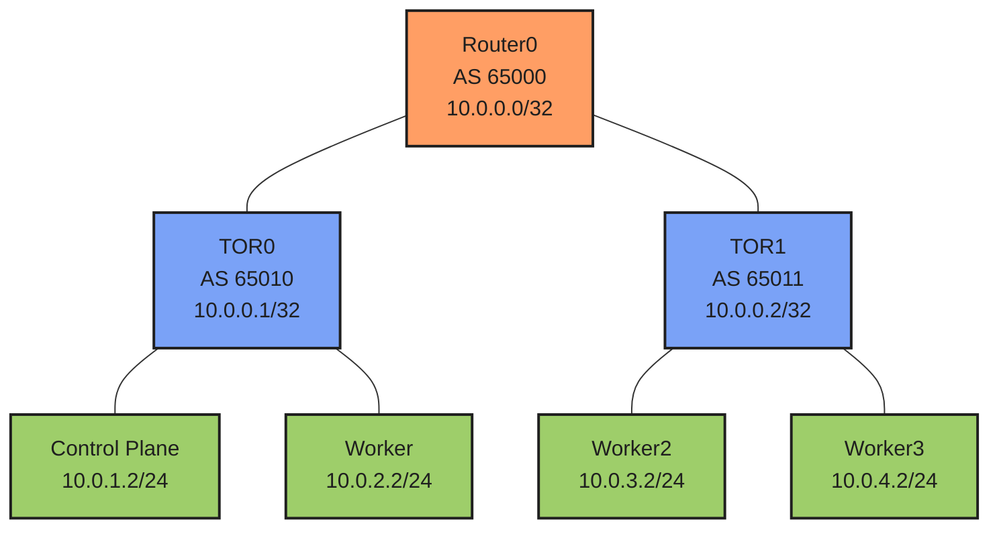

# BGP on Cilium Demo

This project demonstrates BGP (Border Gateway Protocol) integration with Cilium in a Kubernetes environment using ContainerLab for network topology simulation. The setup includes a Kind cluster with multiple nodes and a BGP network topology using FRRouting.

## Network Topology



### Network Details
- **Router0**: Main router (AS 65000)
  - Acts as the network core
  - Provides default route to external networks
  - BGP Router ID: 10.0.0.0

- **TOR0**: Top of Rack Router 1 (AS 65010)
  - Connected to control-plane and worker nodes
  - BGP Router ID: 10.0.0.1
  - Networks: 10.0.1.0/24, 10.0.2.0/24

- **TOR1**: Top of Rack Router 2 (AS 65011)
  - Connected to worker2 and worker3 nodes
  - BGP Router ID: 10.0.0.2
  - Networks: 10.0.3.0/24, 10.0.4.0/24

## Prerequisites

- Docker
- Kind (Kubernetes in Docker)
- ContainerLab
- kubectl
- Cilium CLI

## Quick Start

The project includes a Makefile for easy deployment and management. Here are the main commands:

```bash
# Deploy the complete setup
make all

# Check individual component status
make check-kind      # Check Kind cluster status
make check-clab     # Check ContainerLab status
make check-clab-ui  # Check ContainerLab UI status
make check-cilium   # Check Cilium installation status

# Deploy components individually
make deploy-kind     # Create Kind cluster
make deploy-clab    # Deploy ContainerLab topology
make deploy-clab-ui # Deploy ContainerLab UI
make install-cilium # Install and configure Cilium
make deploy-policies # Deploy BGP peering policies

# Verify the setup
make check-connectivity  # Check BGP connectivity
make test-connectivity  # Test pod connectivity

# Cleanup
make clean        # Delete Kind cluster and stop UI
make destroy-all  # Clean everything including ContainerLab topology
```

## Components

1. **Kind Cluster Configuration** (`cluster.yaml`)
   - Multi-node Kubernetes cluster
   - Configured for Cilium networking

2. **Network Topology** (`topo.yaml`)
   - BGP router configuration using FRRouting
   - Network connectivity between nodes
   - Custom IP addressing scheme

3. **Cilium BGP Configuration** (`cilium-bgp-peering-policies.yaml`)
   - BGP peering policies
   - Node-to-TOR router peering
   - Route advertisement configuration

4. **Testing Tools** (`netshoot-ds.yaml`)
   - Network testing utilities
   - Deployed as a DaemonSet
   - Available on all nodes

## Viewing the Network Topology

ContainerLab UI is available at http://localhost:50080 after deployment. It provides a visual representation of the network topology and connection status.

## Troubleshooting

1. **Check BGP Status**
   ```bash
   make check-connectivity
   ```

2. **Verify Cilium Status**
   ```bash
   cilium status
   cilium config view | grep enable-bgp
   ```

3. **Check Pod Connectivity**
   ```bash
   make test-connectivity
   ```

## Cleanup

To clean up the environment:

1. Remove the Kind cluster and ContainerLab UI:
   ```bash
   make clean
   ```

2. Remove everything including the ContainerLab topology:
   ```bash
   make destroy-all
   ```

## Notes

- The setup uses BGP unnumbered for peering between Cilium and FRR routers
- Each TOR router is in a separate AS
- The main router (router0) acts as the network core and provides default routing
- Cilium is configured with native routing mode and BGP control plane enabled
